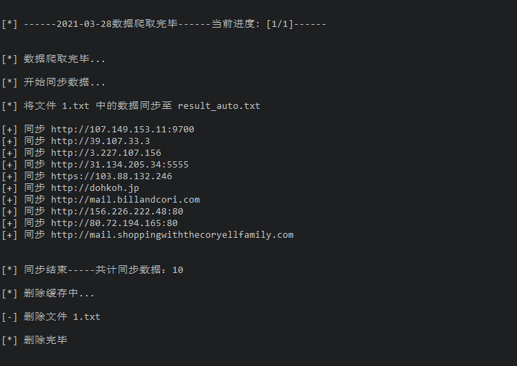

README

fofa升级了，原来的爬虫已经不能用

如果还想用爬虫，请移步https://github.com/409162075/fofa_spider-1.0.2

++++++++++++++++++++++++++++++++++++++++++++++++++++++++++++++++++++++++++++++++

1.基于python3的fofa爬取

2.基于 https://github.com/Cl0udG0d/Fofa-script 程序修改而来

3.配置`config.py`中的`cookie`

4.运行`free_fofa.py`

### 原理

使用暴力抓取方式，强行将每一天的fofa数据抓取下来。如果当天数据大于5页，（非fofa充值会员）默认抓取5页。会员使用本脚本的意义不太大。

如果当天数据小于等于5页，默认全部抓取下来。

demo

抓取完毕后会自动合并、去重

### 注意

fofa有自己的反爬机制，并且规定每天只能搜索500次。
如果爬取太猛，容易被封IP

脚本虽好，但不要贪爬啊！

如果你觉得好用，请给作者买杯咖啡

